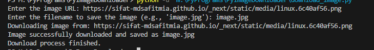

# Image Downloader

This project is a simple command-line tool for downloading images from the web. It validates the URL, checks if the content is an image, and saves it to your local machine with a specified filename.

# Project Screenshot


## Features

- **URL Validation**: Ensures the provided URL is valid and points to an image.
- **Error Handling**: Handles various exceptions such as invalid URLs, timeouts, and HTTP errors.
- **Custom Filename**: Allows users to specify the filename and extension for the downloaded image.
- **Supported Formats**: Works with common image formats like JPG, JPEG, PNG, and GIF.

## Requirements

- Python 3.x
- `requests` library

## Installation

1. Clone the repository:
   ```bash
   git clone https://github.com/sifat-8208/PyImageDownloader.git
   ```
2. Navigate to the project directory:
   ```bash
   cd ImageDownloader
   ```
3. Install the required library:
   ```bash
   pip install requests
   ```

## Usage

1. Run the script:
   ```bash
   python download_image.py
   ```
2. Enter the image URL when prompted.
3. Enter the desired filename with a valid image extension (e.g., 'image.jpg').

## License

This project is licensed under the [MIT License](https://opensource.org/licenses/MIT). You are free to use, modify, and distribute this project.

## Disclaimer

This tool is intended for educational and informational purposes. Ensure you have permission to download and use images from the web. Enjoy using the Image Downloader and feel free to contribute or modify the code as you wish!